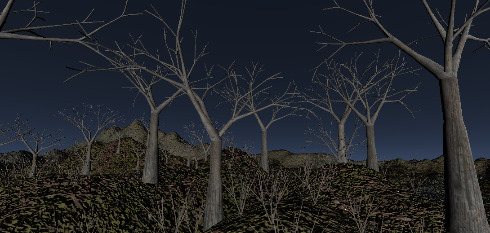
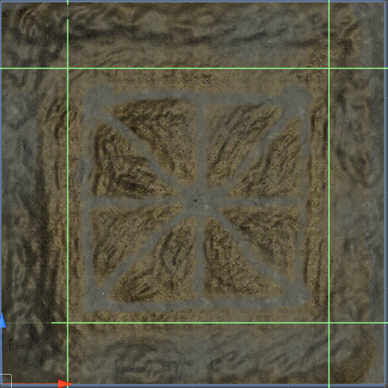
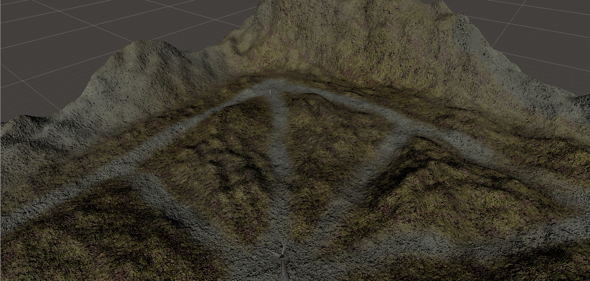
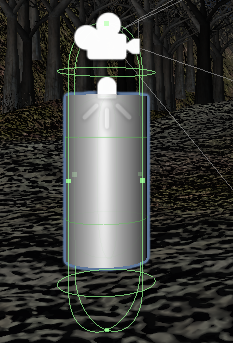

# Lost in the Woods

A simple forest scene with a self-propagating particle system over the tree's mesh.

.png)

**Figure 1:**An overview of the scene, rendered with a tree soft occlusion shader.

## Overview

For this scene, my main objective was to create a dark forest with a burning tree that the user can explore throught a player, that has movement like a game character, that is, can move his body, rotate his head, jump and illuminate the scene with a spot light, acting like a flashlight.

Besides being a simple and small environment, the elements were designed to create the sensation that you are actually in a dark-creepy forest, using resources like a black-gray fog, poor illumination and a different skybox, as well as a tree density outside the main trail that the player can walk. 

The scene has three main parts that will be explained above in each topic:

* Particle System
* Forest
* Player

## Particle System

The first idea to create this was to find a way to simulate fire propagation of a tree, starting from the bottom to the outer branches, activated when the player gets closer to the tree. The final result was fine, but there is some bugs with the fire texture in the tips of the tree, a better implementation of this system was reached using a magical powder instead of fire, the result can be seen above with 2x the normal speed:

.gif)

I started creating the particle system separately, usign a texture found in internet and configurating the parameters like start size, color, rotation over time, and others. A negative gravity was setted to simulate convection (for the fire) and the shader setted to use a additive particle system.

Unity has the option to set a custom mesh to emit particles by the faces, and this was perfect for the simulation. Using C# script, i first clonned the original mesh of the tree, sort the faces in ascending order by the y cordinate values and each iteraction, in the function Update(), I add a new face from the sorted list to the list of faces that will emit particles. The mesh starts empty and each iteraction a new mesh is created with a newer value of face, the downside of this is that the particle system is denser than normal because the particles from the lastest mesh are still in the scene.

## Forest

To create the trees, the models from the previous assingment were textured with a wood texture and their number of triangles decreased to improve performance. Basically a simple commom tree was imported with three distinct variations, as well as a bush scaled down to look like dead grass. 

The map was created to induce the player to follow the trail and arrive at the center to find the "burning tree", different matterials were used in the trails and in the rest of the terrain to ensure this, as well as invisible planes in the corners, acting like invisible walls, restricting the accesible area.

The terrain was made using the Unity Terrain Tool, starting from a plane, the terrain was raised/lowed with different brushes with different sizes, creating patterns for the mountains in the corners and the trails in the middle. All of playable area was raised softly, the places outside the trails are filled with trees and dead grass.

You can paint trees onto a Terrain similar to painting heighmaps, the 3D models of the past assingment were used here, to paint the areas with trees and dead grass. Although these are 3D models, Unity uses optimizations like billboarding for distant Trees to maintain good performance.

To add a dark atmosphere to the forest, the skybox was changed to a dark-gray and the directional lighting of the Sun had it's intensity value lowed to ensure the use of the flashlight. Besides that, a dark fog was added to mask billboarding and fading trees, as well as contribute to the dark atmosphere. The last feature was the shader of the tree's materials, it was choosen the nature tree soft occlusion bark to use features like ambient occlusion, the bad thing of the shader are performance problems and bugs, especially when trees are illuminated with the flashlight.

 

## Player

To allow the user to explore the scene, a player was created to move throught the terrain, as well as interact with it by triggering events, colliding and illuminating areas with a flashlight, which acts like a spotlight. 

The main components of the player are listed above:

* A cylinder to act as the body, it's purpose is just positionate the camera, no renderering or capsule collision are active.

* A camera and a spot light to, respectively, control the viewing and the flashlight direction, both of them are hierarchically connected, because the spotlight must illuminate just the area in front of the player.

* A Player control component, to manage collisions and movement. The movement is just like a game, with the W, A, S, D and mouse move to control the body. The flashlight is turned ON/OFF with a right mouse-click and the character can jump by pressing the space bar. 

## Demo

A demo can be seen in the link above, built with the Unity WebGL module.

Some instructions:

* To find the big tree, just follow the middle trail.
* To shown the cursor again press the ESC key.
* W, A, S,D to move. Mouse to rotate the camera. Right-click of mouse to turn ON/OFF flashlight.

Link:

[DEMO](https://antoniospg.github.io/S3D-ASSINGMENT/SceneDemo.html)
 

