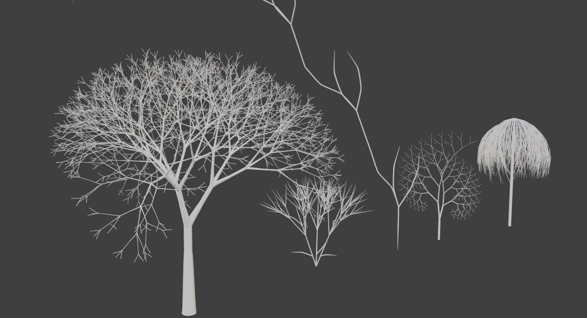
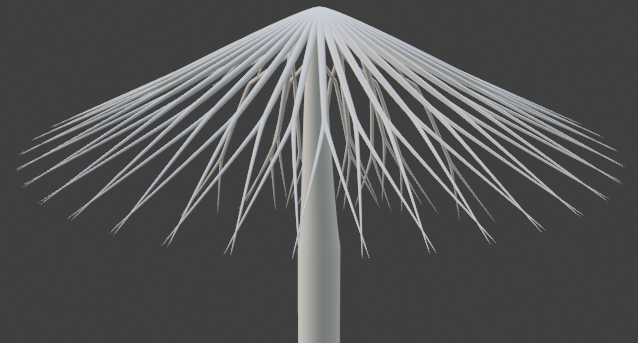
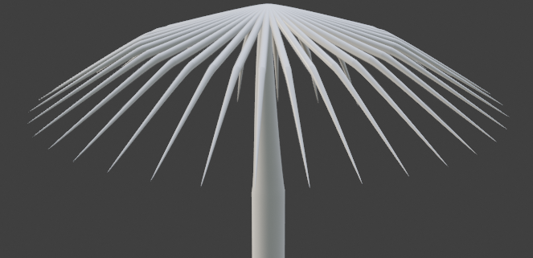
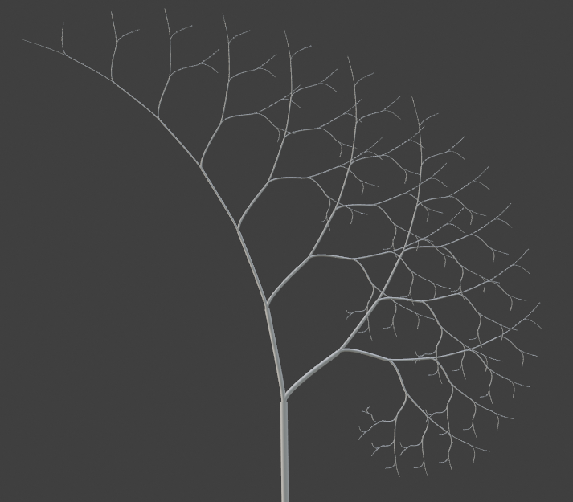
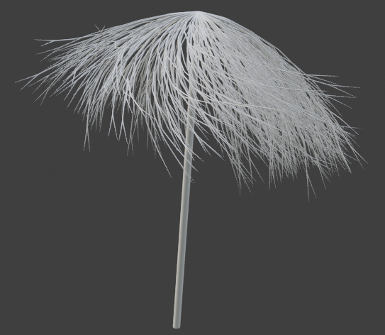
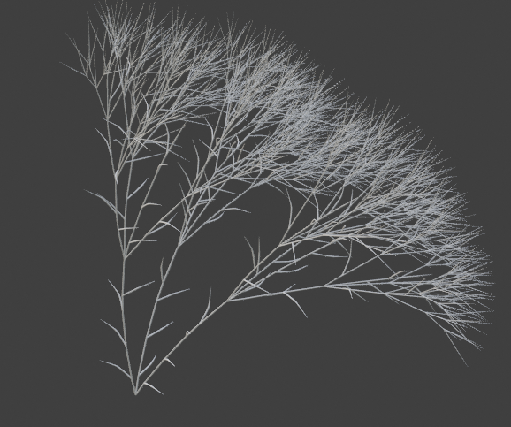

# L-Trees
A simple 3D L-System that can easily generate trees and bushes


**Figure 1:** Fractal trees, generated using the L-systems approach. From left to right: An ordinary tree, a bush, a seaweed, a sympodial tree and a willow.

## Overview

The common way to model a tree involves manually construction of them, demanding high skills and a great amount of time for the person doing this, also, generally, random fluctuations need to be done individually without compromising the tree's species indentity.
A procedural approach can effectively automate the generation, using predetermined instructions acting on an initial state. We can also include random parameters in the instructions to create variation between trees.

The main objective of this assingment is to use Blender software to create a system for procedural generation of 3D Trees using the L-Systems approach. To achive this goal, besides the basic L-System concepts, other techniques were also used, some of them are:

* Stochastic rules
* Parametric rules
* Tropism
* Bezier curve for the model

The fisrt section is dedicated to describe the procedural rules to generate the tree, while the second one for the surface's modelling.

## Generation

The base of every system is to define a grammar G = (V, ω, P), where V is a set of symbols that can and cannot be replaced, ω (axiom) is the first sequence of symbols from V and P is the set of rules that replace a symbol for a sequence of other symbols. The sequence starts as a string defined by ω and after each iteration the symbols of the current sequence are replaced according to the rules defined in P.

This string can be interpreted as a sequence of commands to a turtle, which will move across the space, drawing the tree. The code bellow shows the rules for the seaweed model, shown in the title.
```
Axiom: F
Rules: ( F -> FF+[^F&F&F]-[&F^F^F]n[&f&f^f] ) 
``` 
The interpretaion for some of the symbols is:
```
F(l) or f(l):	 Move turtle forward by l, drawing the tree.
+(a):		 Turn turtle left by a.
-(a):		 Turn turtle right by a.
&(a):		 Pitch turtle down by a.
^(a):		 Pitch turtle up by a.
/(a):		 Roll turtle right by a.
n(a):		 Roll turtle left by a.
[: 		 Start branch.
]:		 End branch
```
Obs: Note that in this grammar, a and l are default values and P only has one element.

<div>

</div>
**Figure 2:** Generation of a bush.

This is the base for the generation of the tree, each model has it's own grammar, with it's own parameters, some of them uses others techniques, tha will be described in the sections bellow.

### Stochastic L-Systems

We can set multiple rules for the same symbol, assigning to each one a probability to occur. In this assingment, we introduce this concept to the willow model, defining two different rules for the branching creation, the first one creates a single continous stem, while the other one creates a double stem. Both branches are shown in the figures bellow:

<div>
 
 
</div>
**Figure 3:** Different branches of the willow.

### Parametric L-Systems
We can also pass arguments through the rules, as shown in this example of a spiral-like quadrangular movement. After each rewriting, the turtle's step decreases in half, causing her to travel less in each movement, converging into the center.
```
Axiom: F(10)A(10)
Rules: ( A(l) -> +(90)F(l/2)A(l/2) ) 
```
In the Sympodial tree model, this was used extensively to shrink the radius and lenght of the further branches.

<div>
 
</div>
**Figure 4:** Sympodial tree extension.

### Tropism
In order to simulate action of external forces like wind or gravity, I implement the tropism vector acting over the tree. It works in a very simple way, rotating the direction of each new branch over the cross product between its direction and the tropism vector. The angle of rotation is defined being proportional to the modulus of the same cross product.

<div>
 
 
</div>

**Figure 5:** Tropism acting over willow and bush

## Modelling 
To create the surface I use the Bézier curve from Blender, which require all control points, as well as the bevel radius of these points. Note that after generated, the tree must be manually converted to a mesh in order to achieve better results.
To get a smoother surface, at each control point one handle was placed in the line that contains the previous segment, an the other handle in the line that contains tha next segment, as shown in the figure bellow:


**Figure 6:** Control points of a segment

## Things to improve

* Add a better sequence generator and a better parser. It will be nice if they both use strings to handle the commands.

* Add a way for the user to create his own grammar in a more interactive way.

* Convert to mesh automatically.

* Implement context sensitive grammars.

* Correct bugs that occur in the connection of branches.

* Implement a better way to control proportionality in order avoid strange looking trees.

