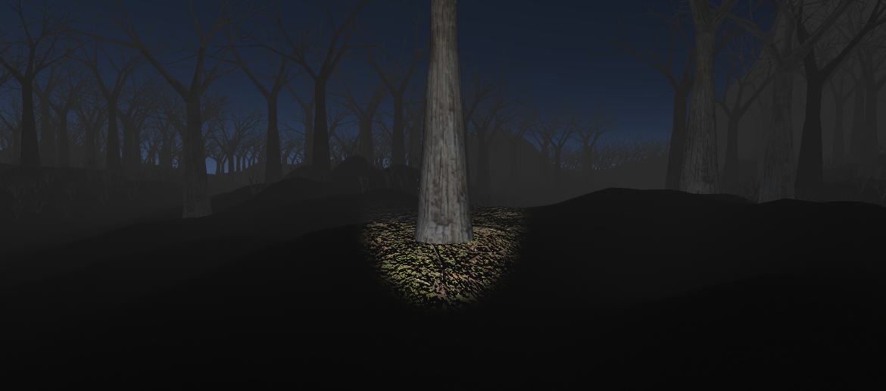

# Lost in the Woods

A simple forest scene with a self-propagating particle system over a mesh.

.png)

**Figure 1:**An overview of the scene, rendered with a tree soft occlusion shader.

## Overview

For this scene, I create a simple forest that a player can navigate through, using the models generated in the last assingment, importing them from Blender to Unity, as well as a particle system that self-progagates through the object's mesh.

The scene has three main parts that will be explained above in each topic:

* Particle System
* Forest
* Player

## Particle System

The main idea was to find a simple way to simulate fire propagation for the burning tree using the Unity Script tool with the default particle system. To achieve this, I first create the fire separately, using a fire texture found in the internet, then I set the particle system to emit from a custom mesh. After that, all the work was made in C# script, just cloning the meshe's list of vertices and triangles, and reording these triangles by the y cordinate values. So, each iteraction, triangles are added in ascending order to a empty mesh, propagating from the bottom to the top, as shown in the figure bellow. 

## Forest

To create the trees, the models from the previous assingment were textured with a wood texture and their number of triangles decreased to improve performance. Basically a simple commom tree was imported with three distinct variations, as well as a bush scaled down to look like dead grass. 

The map was created to induce the player to follow the trail and arrive at the center to find the "burning tree", different matterials were used in the trails and in the rest of the terrain to ensure this, as well as invisible planes in the corners, acting like invisible walls, restricting the accesible area.

The terrain was made using the Unity Terrain Tool, starting from a plane, the terrain was raised/lowed with different brushes with different sizes, creating patterns for the mountains in the corners and the trails in the middle.

You can paint trees onto a Terrain similar to painting heighmaps, the 3D models of the past assingment were used here, painting the areas with trees and dead grass. Although these are 3D models Unity uses optimizations like billboarding for distant Trees to maintain good performance.

To add a dark atmosphere to the forest, the skybox was changed to a dark-gray and the directional lighting of the Sun with a intensity value lowed to ensure the use of the flashlight. Besides that, a dark fog was added to mask billboarding and fading trees, as well as contribute to the dark atmosphere. The last feature was the shader of the tree's materials, it was choosen the nature tree soft occlusion bark to use features like ambient occlusion, besides that this showed performance problems and bugs, especially when illuminated with the flashlight.

 

## Player

To allow the user to explore the scene, a player was created to move throught the terrain, as well as interact with it by triggering events, colliding and illuminating areas with a flashlight, which acts like a spotlight. 

The main components of the player are listed above:

* A cylinder to act as the body, it's purpose is just positionate the camera, no renderering or capsule collision are active.

* A camera and a spot light to, respectively, control the viewing and the flashlight direction, both of them are hierarchically connected, because the spotlight must illuminate just the area in front of the player.

* A Player control component, to manage collisions and movement. The movement is just like a game, with the W, A, S, D and mouse move to control the body. The flashlight is turned ON/OFF with a right mouse-click and the character can jump by pressing the space bar. 

