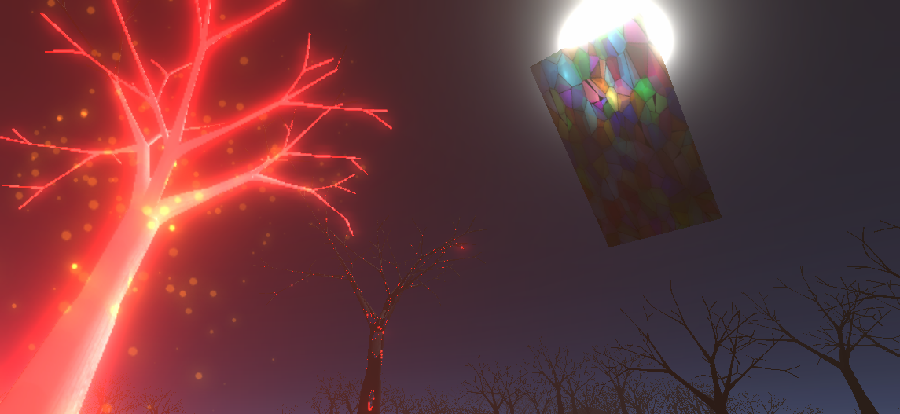
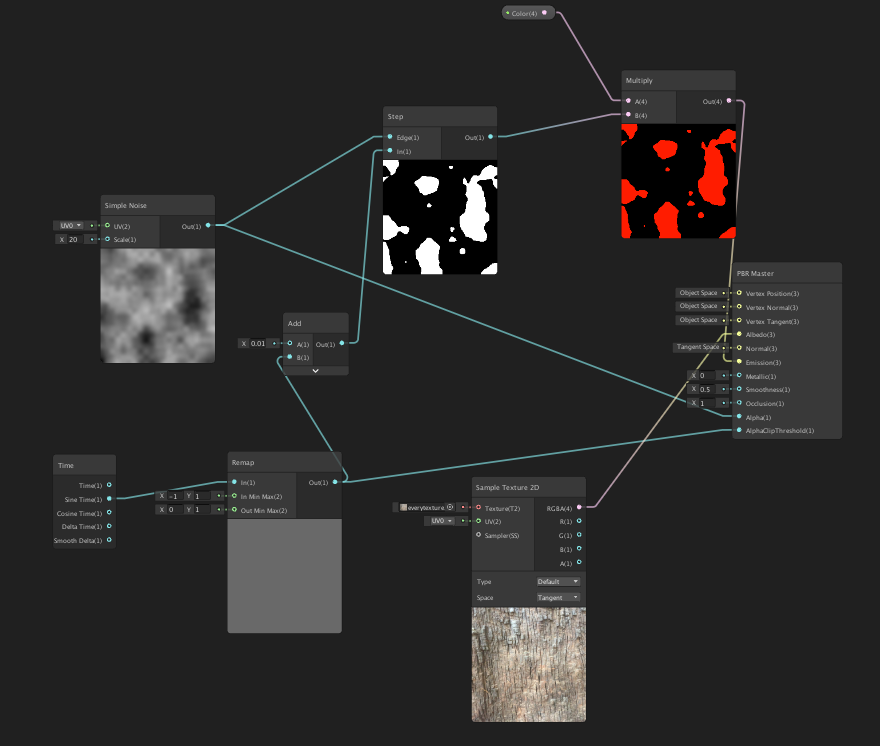

# Render Experiments

**Figure 1:** Some results obtained with different techniques 
## Overview

The main goal of this assignment is to learn more about rendering, creating different types of effects in Unity, and testing the different tools that are provided to the developer, extending the scene from the previous assignment with new visual features.
 
In this project, the Universal Render Pipeline(URP) was used to take advantage of optimizations on lightweight platforms like WebGL, as well as try out the ShaderGraph feature. The experiments were made exploring three main areas: Post-Effects, ShaderGraph, and common CG shaders, for each of these, different visual effects were created, exploring the particularities of each tool.

## Post-Effects

Taking advantage of the particle system created in the previous assignment, I decided to implement a system that makes just the areas that are emitting particles glow, so the shine effect will start from the bottom and progress to the top.
  
To achieve this, I create a material with the same texture as the tree, but the Emission Map field of it was filled with intense red color, then I create a GameObject with this material, but without a mesh associated with it. 
To obtain the glow, the post-processing effect bloom was added to the scene with a high threshold to make sure that the effect will be applied just in the intense red color of the material and not in undesirable places.
  
Each iteration, when new triangles are added to the custom mesh created via C# script, the "mesh" property of the GameObject is filled with an updated value, creating a progressive illumination effect, which can be seen below:

 
**Figure 2:** Bloom effect in my particle emitter model.

## Shader Graph 

With Shader Graph it's very simple to get incredible visual results. Instead of writing code for the shader, you can create nodes in a graph network and connecting them to get, in real-time, the desirable result.
  
For this experiment, I create a simple hologram effect and applied it to my tree model, creating some sort of cyberpunk dissolving. The modeling is simple and straightforward, basically just applying in the AlphaChannel a noise texture to delimit clipped parts and a continuous and periodic time-variant value to AlphaClipThreshold . Both of the simple graph network and the final result can be seen below:

 
**Figure 3:** Shader Graph network.
 
 

 
**Figure 4:** Final result.

## CG Shader Code

Although Shader Graph is a great tool for shading, Unity still offers the possibility to create shader codes the old fashion way using HLSL CG, being useful in cases when low-level programming is required to achieve the desired effect.
 
Two effects were made, a stained glass transparent effect and a heat distortion effect.

* **Stained Glass**
This was created by assigning a plane to the material that contains the shader. We need to supply the shader a glass texture (in this case a stained glass texture) and a normal map to offset the uv data.
 
The core that this shader uses is the _CameraOpaqueTexture variable to take what has already been rendered on the screen. With this texture, we just overlay these pixels with the pixels from the glass texture, adding some noise to look more realistic. 

 
**Figure 5:** Moon seen through the glass.
 
 
* **Heat distortion**
This shader simulates the distortion effect caused by hot things, in this scenario, a campfire.
 
The first step is assigning to a plane a material that contains the shader, this plane needs to be a billboard, that is, always facing the view position, besides that it needs to be rendered on top of everything.
 
After that, we need to again use the _CameraOpaqueTexture variable for the same purpose above and distort this texture with a time-variant noise function, created from a noise texture image, and finally resampling the camera texture.
 

 
**Figure 5:** Campfire with the distortion effect.

